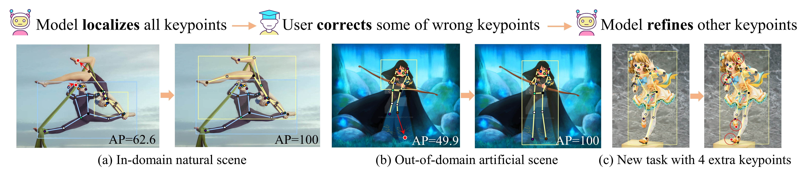
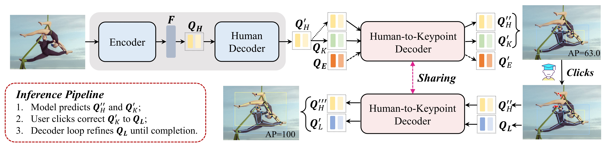

# Neural Interactive Keypoint Detection
This is the official pytorch implementation of our ICCV 2023 paper "Neural Interactive Keypoint Detection." 

[Jie Yang](https://github.com/yangjie-cv), [Ailing Zeng](https://ailingzeng.site/), [Feng Li](https://scholar.google.com/citations?user=ybRe9GcAAAAJ&hl=zh-CN), [Shilong Liu](http://www.lsl.zone/), [Ruimao Zhang](http://www.zhangruimao.site/), [Lei Zhang](https://www.leizhang.org/)

**Keywords**: 👯 Multi-person 2D pose estimation, 💃 Human-in-the-loop, 🤝Interactive model 

## ❤️ Highlights
- Click-Pose has been supported in our **[DeepDataSpace](https://github.com/IDEA-Research/deepdataspace)** platform. See details for *How to perform intelligent labeling with DDS [here](https://docs.deepdataspace.com/tutorials/ai-annotation.html).*

- #### Work flow: 🤖 Model localizes all keypoints -> 👨 User corrects a few wrong keypoints -> 🤖 Model refines other keypoints

  

## 💙 Click-Pose

- 👇 We first propose an **interactive keypoint detection task** for efficient keypoint annotation.


- 👇 We present the first neural interactive keypoint detection framework, Click-Pose, an end-to-end baseline to annotate multi-person 2D keypoints given an image. 
  

- 👇 Click-Pose is more than **10** times faster than manual annotation. Importantly, it significantly alleviates model bias in out-of-domain annotation (e.g., on Human-Art), reducing the time required by **83%** compared to state-of-the-art model annotation ([ViTPose](https://github.com/ViTAE-Transformer/ViTPose)) with manual correction.


## ▶ Demo
#### In-Domain Annotation (e.g., on COCO)
  


#### Out-of-Domain Annotation (e.g., on Human-Art)
  


## 🚀 Model Zoo

### 1. Model-Only Results 

#### COCO val2017 set

|   Model    | Backbone  | Lr schd | mAP  | AP<sup>50</sup> | AP<sup>75</sup> | AP<sup>M</sup> | AP<sup>L</sup> | Time (ms) |                                                 Model                                                 |
|:----------:|:---------:|:-------:|:----:|:---------------:|:---------------:|:--------------:|:--------------:|:---------:|:-----------------------------------------------------------------------------------------------------:|
|  ED-Pose   | ResNet-50 |   60e   | 71.7 |      89.7       |      78.8       |      66.2      |      79.7      |    51     |                          [GitHub](https://github.com/IDEA-Research/ED-Pose), [Model](https://drive.google.com/file/d/1Q5OpZeCvaSgqC0NlKeRiJFmHBtusxnjX/view?usp=sharing)                        |
| Click-Pose |   ResNet-50    |   40e   | 73.0 |      90.4       |      80.0       |      68.1      |      80.5      |    48     | [Google Drive](https://drive.google.com/file/d/1_rp12m0fkpSc7LQ1oXeifdt8SbwcSHtS/view?usp=sharing) |

#### Human-Art val set

|   Model    |   Backbone     | mAP  | AP<sup>M</sup> | AP<sup>L</sup> |                                           Model                                                |
|:----------:|:-------------:|:----:|:--------------:|:--------------:|:-----------------------------------------------------------------------------------------------------:|
|  ED-Pose   |     ResNet-50        | 37.5 |      7.6       |      41.1      |    [GitHub](https://github.com/IDEA-Research/ED-Pose), [Model](https://drive.google.com/file/d/1Q5OpZeCvaSgqC0NlKeRiJFmHBtusxnjX/view?usp=sharing)          |
| Click-Pose |    ResNet-50       | 40.5 |      8.3       |      44.2      | [Google Drive](https://drive.google.com/file/d/1_rp12m0fkpSc7LQ1oXeifdt8SbwcSHtS/view?usp=sharing) |

#### OCHuman test set

|   Model    |   Backbone     | mAP  | AP<sup>50</sup> | AP<sup>75</sup> |                                           Model                                                |
|:----------:|:-------------:|:----:|:---------------:|:---------------:|:-----------------------------------------------------------------------------------------------------:|
|  ED-Pose   |     ResNet-50        | 31.4 |      39.5       |      35.1       |    [GitHub](https://github.com/IDEA-Research/ED-Pose), [Model](https://drive.google.com/file/d/1Q5OpZeCvaSgqC0NlKeRiJFmHBtusxnjX/view?usp=sharing)          |
| Click-Pose |    ResNet-50       | 33.9 |      43.4       |      37.5       | [Google Drive](https://drive.google.com/file/d/1_rp12m0fkpSc7LQ1oXeifdt8SbwcSHtS/view?usp=sharing) |

Note that the model is trained on COCO train2017 set and tested on COCO val2017 set, Human-Art val set, and OCHuman test set.

### 2. Neural Interactive  Results 

#### In-domain Annotation (COCO val2017)

|   Model    |   Backbone     | NoC@85 | NoC@90 | NoC@95 |                                           Model                                                |
|:----------:|:-------------:|:------:|:------:|:------:|:-----------------------------------------------------------------------------------------------------:|
|  ViTPose   |     ResNet-50        |  1.46  |  2.15  |  2.87  |     [GitHub](https://github.com/ViTAE-Transformer/ViTPose), [Model](https://1drv.ms/u/s!AimBgYV7JjTlgShLMI-kkmvNfF_h?e=dEhGHe)      |
| Click-Pose |    ResNet-50       |  0.95  |  1.48  |  1.97  | [Google Drive](https://drive.google.com/file/d/184RIVxFVrDho4Nw5Yquh6fedTKpsZVYX/view?usp=sharing) |


#### Out-of-domain Annotation (Human-Art val)

|   Model    |   Backbone     | NoC@85 | NoC@90 | NoC@95 |                                           Model                                                |
|:----------:|:-------------:|:------:|:------:|:------:|:-----------------------------------------------------------------------------------------------------:|
|  ViTPose   |     ResNet-50        |  9.12  |  9.79  | 10.13  |     [GitHub](https://github.com/ViTAE-Transformer/ViTPose), [Model](https://1drv.ms/u/s!AimBgYV7JjTlgShLMI-kkmvNfF_h?e=dEhGHe)     |
| Click-Pose |    ResNet-50       |  4.82  |  5.81  |  6.45  | [Google Drive](https://drive.google.com/file/d/184RIVxFVrDho4Nw5Yquh6fedTKpsZVYX/view?usp=sharing) |


## 🔨 Environment Setup 

<details>
  <summary>Installation</summary>
  
  We use the [ED-Pose](https://github.com/IDEA-Research/ED-Pose) as our codebase. We test our models under ```python=3.7.3,pytorch=1.9.0,cuda=11.1```. Other versions might be available as well.

   1. Clone this repo
   ```sh
   git clone https://github.com/IDEA-Research/Click-Pose.git
   cd Click-Pose
   ```

   2. Install Pytorch and torchvision

   Follow the instruction on https://pytorch.org/get-started/locally/.
   ```sh
   # an example:
   conda install -c pytorch pytorch torchvision
   ```

   3. Install other needed packages
   ```sh
   pip install -r requirements.txt
   ```

   4. Compiling CUDA operators
   ```sh
   cd models/clickpose/ops
   python setup.py build install
   # unit test (should see all checking is True)
   python test.py
   cd ../../..
   ```
</details>

<details>
  <summary>Data Preparation</summary>

**For COCO data**, please download from [COCO download](http://cocodataset.org/#download). 
The coco_dir should look like this:
```
|-- Click-Pose
`-- |-- coco_dir
    `-- |-- annotations
        |   |-- person_keypoints_train2017.json
        |   `-- person_keypoints_val2017.json
        `-- images
            |-- train2017
            |   |-- 000000000009.jpg
            |   |-- 000000000025.jpg
            |   |-- 000000000030.jpg
            |   |-- ... 
            `-- val2017
                |-- 000000000139.jpg
                |-- 000000000285.jpg
                |-- 000000000632.jpg
                |-- ... 
```
**For Human-Art data**, please download from [Human-Art download](https://github.com/IDEA-Research/HumanArt), 
The humanart_dir should look like this:
```
|-- Click-Pose
`-- |-- humanart_dir
    `-- |-- annotations 
        |   |-- training_humanart.json
        |   |-- validation_humanart.json
        `-- images
            |-- 2D_virtual_human
                |-- ...
            |-- 3D_virtual_human
                |-- ...
            |-- real_human
                |-- ...
```


**For CrowdPose data**, please download from [CrowdPose download](https://github.com/Jeff-sjtu/CrowdPose#dataset), 
The crowdpose_dir should look like this:
```
|-- Click-Pose
`-- |-- crowdpose_dir
    `-- |-- json
        |   |-- crowdpose_train.json
        |   |-- crowdpose_val.json
        |   |-- crowdpose_trainval.json (generated by util/crowdpose_concat_train_val.py)
        |   `-- crowdpose_test.json
        `-- images
            |-- 100000.jpg
            |-- 100001.jpg
            |-- 100002.jpg
            |-- 100003.jpg
            |-- 100004.jpg
            |-- 100005.jpg
            |-- ... 
```
**For OCHuman data**, please download from [OCHuman download](https://github.com/liruilong940607/OCHumanApi). 
The ochuman_dir should look like this:
```
|-- Click-Pose
`-- |-- ochuman_dir
    `-- |-- annotations
        `-- images
```

</details>


## 🥳 Run


### Train on COCO:

<details>
  <summary>Model-Only</summary>

```
export CLICKPOSE_COCO_PATH=/path/to/your/coco_dir
 python -m torch.distributed.launch --nproc_per_node=4 main.py \
    --output_dir "logs/ClickPose_Model-Only" \
    -c config/clickpose.cfg.py \
    --options batch_size=4 epochs=100 lr_drop=80 use_ema=TRUE human_feedback=FLASE feedback_loop_NOC_test=FALSE feedback_inference=FALSE only_correction=FALSE
    --dataset_file="coco"
```
</details>


<details>
  <summary>Neural Interactive</summary>

```
export CLICKPOSE_COCO_PATH=/path/to/your/coco_dir
 python -m torch.distributed.launch --nproc_per_node=4 main.py \
    --output_dir "logs/ClickPose_Neural_Interactive" \
    -c config/clickpose.cfg.py \
    --options batch_size=4 epochs=100 lr_drop=80 use_ema=TRUE human_feedback=TRUE feedback_loop_NOC_test=FALSE feedback_inference=FALSE only_correction=FALSE
    --dataset_file="coco"
```
</details>


### Evaluation on COCO:

<details>
  <summary>Model-Only</summary>

```
export CLICKPOSE_COCO_PATH=/path/to/your/coco_dir
 python -m torch.distributed.launch --nproc_per_node=4 main.py \
    --output_dir "logs/ClickPose_Model-Only_eval" \
    -c config/clickpose.cfg.py \
    --options batch_size=4 epochs=100 lr_drop=80 use_ema=TRUE human_feedback=FLASE feedback_loop_NOC_test=FALSE feedback_inference=FALSE only_correction=FALSE
    --dataset_file="coco"
    --pretrain_model_path "./models/ClickPose_model_only_R50.pth" \
    --eval
```
</details>


<details>
  <summary>Neural Interactive-NoC metric</summary>

```
export CLICKPOSE_COCO_PATH=/path/to/your/coco_dir
export CLICKPOSE_NoC_Test="TRUE"
    python -m torch.distributed.launch --nproc_per_node=4 --master_port 3458 main.py \
    --output_dir "logs/ClickPose_Neural_Interactive_eval" \
    -c config/clickpose.cfg.py \
    --options batch_size=4 epochs=100 lr_drop=80 use_ema=TRUE human_feedback=TRUE feedback_loop_NOC_test=TRUE feedback_inference=TRUE only_correction=FALSE num_select=20 
    --dataset_file="coco"
    --pretrain_model_path "./models/ClickPose_interactive_R50.pth" \
    --eval
```
</details>


<details>
  <summary>Neural Interactive-AP metric</summary>

```
export CLICKPOSE_COCO_PATH=/path/to/your/coco_dir
export CLICKPOSE_NoC_Test="TRUE"
for CLICKPOSE_Click_Number in {1..17}
do
    python -m torch.distributed.launch --nproc_per_node=4 --master_port 3458 main.py \
    --output_dir "logs/ClickPose_Neural_Interactive_eval" \
    -c config/clickpose.cfg.py \
    --options batch_size=4 epochs=100 lr_drop=80 use_ema=TRUE human_feedback=TRUE feedback_loop_NOC_test=FALSE feedback_inference=TRUE only_correction=FALSE num_select=20 
    --dataset_file="coco"
    --pretrain_model_path "./models/ClickPose_interactive_R50.pth" \
    --eval
done


```
</details>


### Evaluation on Human-Art:

<details>
  <summary>Model-Only</summary>

```
export CLICKPOSE_HumanArt_PATH=/path/to/your/humanart_dir
 python -m torch.distributed.launch --nproc_per_node=4 main.py \
    --output_dir "logs/ClickPose_Model-Only_eval" \
    -c config/clickpose.cfg.py \
    --options batch_size=4 epochs=100 lr_drop=80 use_ema=TRUE human_feedback=FLASE feedback_loop_NOC_test=FALSE feedback_inference=FALSE only_correction=FALSE
    --dataset_file="humanart"
    --pretrain_model_path "./models/ClickPose_model_only_R50.pth" \
    --eval
```
</details>


<details>
  <summary>Neural Interactive-NoC metric</summary>

```
export CLICKPOSE_HumanArt_PATH=/path/to/your/humanart_dir
export CLICKPOSE_NoC_Test="TRUE"
    python -m torch.distributed.launch --nproc_per_node=4 --master_port 3458 main.py \
    --output_dir "logs/ClickPose_Neural_Interactive_eval" \
    -c config/clickpose.cfg.py \
    --options batch_size=4 epochs=100 lr_drop=80 use_ema=TRUE human_feedback=TRUE feedback_loop_NOC_test=TRUE feedback_inference=TRUE only_correction=FALSE num_select=20 
    --dataset_file="humanart"
    --pretrain_model_path "./models/ClickPose_interactive_R50.pth" \
    --eval
```
</details>


<details>
  <summary>Neural Interactive-AP metric</summary>

```
export CLICKPOSE_HumanArt_PATH=/path/to/your/humanart_dir
export CLICKPOSE_NoC_Test="TRUE"
for CLICKPOSE_Click_Number in {1..17}
do
    python -m torch.distributed.launch --nproc_per_node=4 --master_port 3458 main.py \
    --output_dir "logs/ClickPose_Neural_Interactive_eval" \
    -c config/clickpose.cfg.py \
    --options batch_size=4 epochs=100 lr_drop=80 use_ema=TRUE human_feedback=TRUE feedback_loop_NOC_test=FALSE feedback_inference=TRUE only_correction=FALSE num_select=20 
    --dataset_file="humanart"
    --pretrain_model_path "./models/ClickPose_interactive_R50.pth" \
    --eval
done


```
</details>


### Evaluation on OCHuman:

<details>
  <summary>Model-Only</summary>

```
export CLICKPOSE_OCHuman_PATH=/path/to/your/ochuman_dir
 python -m torch.distributed.launch --nproc_per_node=4 main.py \
    --output_dir "logs/ClickPose_Model-Only_eval" \
    -c config/clickpose.cfg.py \
    --options batch_size=4 epochs=100 lr_drop=80 use_ema=TRUE human_feedback=FLASE feedback_loop_NOC_test=FALSE feedback_inference=FALSE only_correction=FALSE
    --dataset_file="ochuman"
    --pretrain_model_path "./models/ClickPose_model_only_R50.pth" \
    --eval
```
</details>


<details>
  <summary>Neural Interactive-NoC metric</summary>

```
export CLICKPOSE_OCHuman_PATH=/path/to/your/ochuman_dir
export CLICKPOSE_NoC_Test="TRUE"
    python -m torch.distributed.launch --nproc_per_node=4 --master_port 3458 main.py \
    --output_dir "logs/ClickPose_Neural_Interactive_eval" \
    -c config/clickpose.cfg.py \
    --options batch_size=4 epochs=100 lr_drop=80 use_ema=TRUE human_feedback=TRUE feedback_loop_NOC_test=TRUE feedback_inference=TRUE only_correction=FALSE num_select=20 
    --dataset_file="ochuman"
    --pretrain_model_path "./models/ClickPose_interactive_R50.pth" \
    --eval
```
</details>


<details>
  <summary>Neural Interactive-AP metric</summary>

```
export CLICKPOSE_OCHuman_PATH=/path/to/your/ochuman_dir
export CLICKPOSE_NoC_Test="TRUE"
for CLICKPOSE_Click_Number in {1..17}
do
    python -m torch.distributed.launch --nproc_per_node=4 --master_port 3458 main.py \
    --output_dir "logs/ClickPose_Neural_Interactive_eval" \
    -c config/clickpose.cfg.py \
    --options batch_size=4 epochs=100 lr_drop=80 use_ema=TRUE human_feedback=TRUE feedback_loop_NOC_test=FALSE feedback_inference=TRUE only_correction=FALSE num_select=20 
    --dataset_file="ochuman"
    --pretrain_model_path "./models/ClickPose_interactive_R50.pth" \
    --eval
done


```
</details>


### Cite Click-Pose
If you find this repository useful for your work, please consider citing it as follows:

```
@inproceedings{yang2023nerual,
  title={Neural Interactive Keypoint Detection},
  author={Yang, Jie and Zeng, Ailing and Li, Feng and Liu, Shilong and Zhang, Ruimao and Zhang, Lei},
  booktitle={Proceedings of the IEEE/CVF international conference on computer vision},
  year={2023}
}
```

```
@inproceedings{yang2022explicit,
  title={Explicit Box Detection Unifies End-to-End Multi-Person Pose Estimation},
  author={Yang, Jie and Zeng, Ailing and Liu, Shilong and Li, Feng and Zhang, Ruimao and Zhang, Lei},
  booktitle={The Eleventh International Conference on Learning Representations},
  year={2022}
}
```


